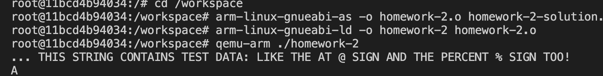

# Homework 2 Solution

This document explains the approach taken to solve the problem of converting a string to uppercase and lowercase in assembly language.

## Approach

### 1. **Understanding the Problem**
The task was to write assembly code that iterates over a string and converts all lowercase letters (`a-z`) to uppercase (`A-Z`) and vice versa. The modified string must be saved back to memory.

### 2. **Assembly Code Structure**
The solution is divided into two main functions:
- `to_upper`: Converts lowercase letters to uppercase.
- `to_lower`: Converts uppercase letters to lowercase.

Both functions follow a similar structure:
1. Load the address of the string into a register.
2. Iterate over each character in the string.
3. Check if the character is within the range of lowercase or uppercase letters.
4. Convert the character by adding or subtracting 32 (the difference between lowercase and uppercase in ASCII).
5. Store the modified character back to memory.
6. Repeat until the end of the string is reached.

### 3. **Key Details**
- **Character Range Check**: The ASCII values for lowercase letters (`a-z`) are 97-122, and for uppercase letters (`A-Z`) are 65-90. The difference between them is 32.
- **Loop Termination**: The loop terminates when a null character (`\0`) is encountered, indicating the end of the string.
- **Memory Management**: The modified characters are stored back into memory using the `strb` instruction.

### 4. **Testing**
The program was tested using the provided `test_case_1` string. Screenshots of the output are included below.

## Screenshots

### Screenshot 1: `to_upper` Output

### Screenshot 2: `to_lower` Output

## Conclusion
The solution successfully converts strings to uppercase and lowercase. The code is well-commented and adheres to best practices in assembly programming.
